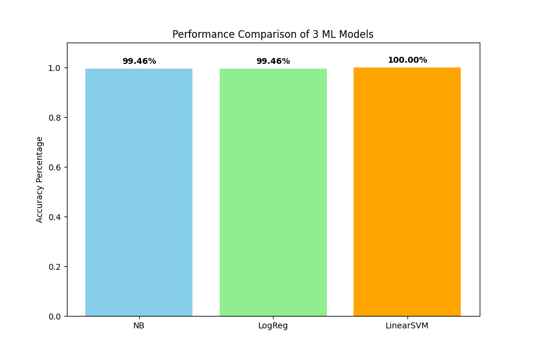

# Sports vs. Politics: Text Classification

**Author:** Rishabh Tripathi  
**Roll Number:** M25CSE026  
**Course:** Natural Language Understanding (NLU)

## Project Overview
This repository contains the deliverables for Problem 4 of the NLU assignment 1. The objective of this project is to classify news articles as either **Sports** or **Politics** using Machine Learning.

Due to network restrictions with the standard `20 Newsgroups` dataset, this project utilizes the **BBC News Dataset**, which provides a highly professional and structured corpus for text classification. 

## Repository Contents
* `M25CSE026_prob4.py`: The main Python script containing the data ingestion, TF-IDF vectorization, and machine learning models.
* `comparison_chart.png`: The generated bar chart visualizing the accuracy of the three models.
* `M25CSE026_prob4.pdf`: The detailed report covering the methodology, mathematical theory, and system limitations.

## Methodology
1. **Data Preprocessing:** The text was filtered for the target categories and split into 80% training and 20% testing sets.
2. **Feature Extraction:** Implemented **TF-IDF (Term Frequency-Inverse Document Frequency)** capped at 3,000 features, with standard English stop-words removed.
3. **Model Comparison:** Evaluated three distinct algorithms:
   * Multinomial Naive Bayes
   * Logistic Regression
   * Linear Support Vector Machine (SVM)

## Results
The dataset proved highly separable due to the distinct vocabularies of sports and politics. The models achieved the following test accuracies:
* **Naive Bayes:** 99.46%
* **Logistic Regression:** 99.46%
* **Linear SVM:** 100.00%



## How to Run the Code
This script is designed to run independently without requiring manual dataset downloads.
1. Ensure you have the required libraries installed:
   ```bash
   pip install pandas matplotlib scikit-learn requests
2. Run the script from your terminal:
    python M25CSE026_prob4.py
